# cargo-port

[](https://github.com/natepiano/cargo-port/actions/workflows/ci.yml)
[](https://crates.io/crates/cargo-port)
[](LICENSE-MIT)


cargo-port is a terminal dashboard for your Rust workspaces and projects. Configure it to scan one or more directories to view workspaces, crates, worktrees, vendored dependencies, targets, local lint state, GitHub CI, pull requests, and machine diagnostics in one keyboard-driven view.

See everything about your rust environment in one place. Every question answered without having to hit the cli. Dynamically updated.  Maybe you're using a coding agent, I won't judge. While your agents are doing all the work, cargo-port will show you what's up!

And if you're old school, the information is dense and informative. And fast. There is no better overview of all of your project info (confidently asserted...and...PRs welcome).

## Features

- **Inventory everything** - workspaces, members, linked worktrees, submodules, vendored crates, examples, benches, binaries, tests, and non-Rust git repos
- **Run and inspect targets** - launch examples, benches, and binaries in debug or release mode with live output and running-target markers
- **Track project health** - see lint status, archived lint runs, GitHub Actions history, open pull requests, PR check polling, and GitHub rate-limit state
- **Keep context visible** - inspect package metadata, target directories, language stats, worktree summaries, remotes, CI jobs, and pull request rows without leaving the TUI
- **Navigate quickly** - fuzzy search, vim-style paging, keymaps, tab traversal, global shortcuts, and selection copy
- **Themes** - light/dark/high-contrast variants, and hot-reload - there's not a lot of themes here yet, but you know, PRs welcome

The initial startup scan runs async and is fun to watch.

## Try me

cargo-port tracks current stable Rust. Any modern terminal works - the icons are plain emoji, no Nerd Font required.

Install the latest published crates.io release:

```bash
cargo install cargo-port
cargo port
```

Or build the current `main` branch:

```bash
git clone https://github.com/natepiano/cargo-port.git
cd cargo-port
cargo build
cargo run
```

### Enable GitHub metadata

CI runs, the CI status column, pull requests, repo stars/description, and rate-limit state all come from GitHub's API. cargo-port reads your auth token from the [GitHub CLI](https://cli.github.com), so install it and log in to  make this information available.

```bash
gh auth login
```

Everything local - git status, remotes, worktrees, languages, targets, lint runs, CPU/GPU - works without it; you'll just get a warning where the GitHub data would be. The token is read once at startup, so restart cargo-port after logging in.

The token comes from a single `gh auth token` call at startup - cargo-port never reads token env vars itself. Setting `GH_TOKEN` or `GITHUB_TOKEN` works too since gh passes those through, but the `gh` binary must be installed either way. Private repos show GitHub data only if your token can read them.

## cargo-port panes overview

The dashboard combines a project tree in the upper left with detail panes for package metadata, Git state, languages, CPU/GPU activity, targets, lint history, and CI runs - all shown based on the currently selected project in the upper left.

I try to keep the screenshots up to date but it's a lot of work so it is possible the version you install will vary slightly from this readme (again, PRs welcome).

### Dashboard view

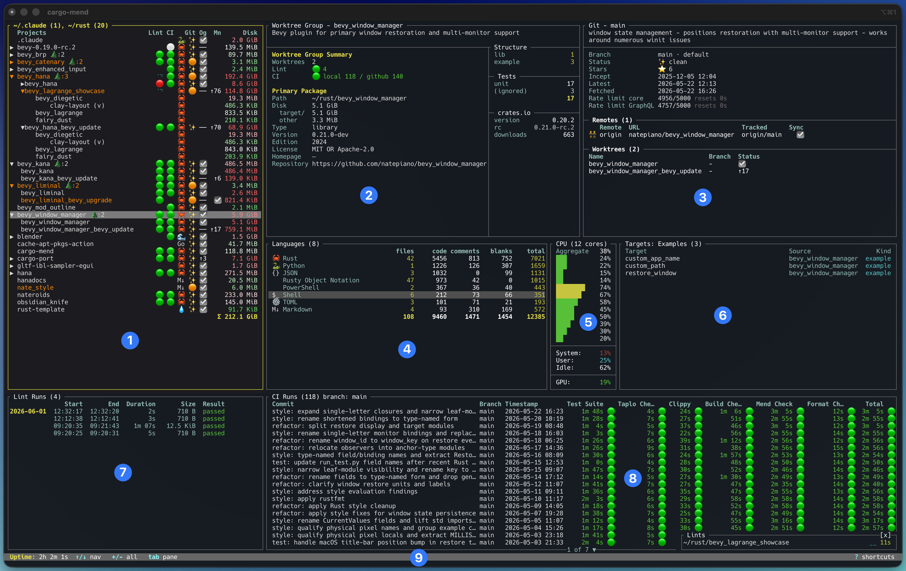

1. **Project tree** workspaces, members, linked worktrees, submodules, vendored crates, optional non-Rust repos, status columns, and disk rollups.
2. **Workspace details**: Cargo metadata-backed package summary, disk breakdown, lint/CI rollups, and target structure counts.
3. **Git**: branch status, sync state, remotes, worktrees, GitHub rate-limit state, and pull request rows when available.
4. **Languages**: per-project language totals by file count, code, comments, blanks, and total lines.
5. **Diagnostics**: CPU and GPU utilization, with background refresh.
6. **Targets**: examples, benches, binaries, and tests with source package and target kind.
7. **Lint runs**: local lint/watch history and cached run artifacts.
8. **CI runs**: GitHub Actions history with job-level status and duration columns.
9. **Status bar**: current mode, pane navigation, active action, and shortcut help.

### Settings overlay

At first run, you will be prompted to update your Include dirs in the Settings overlay so we may as well cover this now. Settings impact much of what is discussed further on.

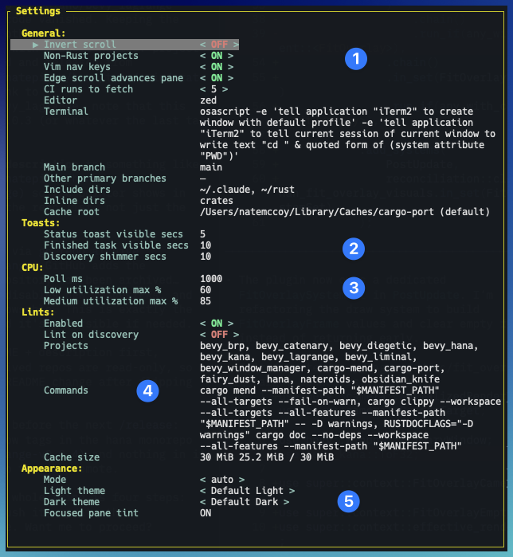
#### 1 - General

- **Invert scroll** - cargo-port supports mouse scrolling so you can set this how you like

- **Non-Rust projects** - when on, if `Include dirs` finds a directory with a .git repo, it will include it whether it is rust or not. cargo-port has a lot of rust focused features but you can see useful information about non-rust this way also.

- **Vim nav keys** - we have very basic vim motion controls. Turn this on if Vim is your jam.

- **Edge scroll advances pane** - if you use your keyboard to scroll, scrolling past the last row in an info pane will take you to the next pane and continue all the way around the loop. Turn it off if this doesn't suit you. This feature is not mouse-aware.

- **Editor** - pressing `e` will pass the directory of the currently selected project to this configured editor.

- **Terminal** - pressing `t` runs this command from the selected project's
  directory. Use `{path}` if your terminal command needs the path as an
  argument. If this is blank, pressing `t` jumps you to this setting.

- **Main branch** - what branch name should be considered `main` in cargo-port. See details after this section.

- **Other primary branches** - you may want to have one or more other branches considered primary.

- **Include dirs** - you may provide a list of directories that will be scanned at startup for display in cargo-port. cargo-port cannot function without a value here.

- **Inline dirs** - The project tree is hierarchical and will display workspace members within the directories in which they are located. If you don't want that level of indirection, you can put a list of names here, and that level will be removed.  For example, if you have a bunch of workspace members in a `crates` directory, entering crates here will have all of those members show up immediately underneath the workspace name in the project tree.

- **Cache root** - location for lint runs and locally cached ci runs from GitHub. Default comes from dirs crate - `dirs::cache_dir()`.

**Main and Primary branches in practice**

For local Git info, cargo-port checks main_branch first, then each other_primary_branches entry, and uses the first branch that exists as the local primary comparison branch. That drives the Git pane’s “vs main/primary/etc” ahead-behind display.

For remotes, it is the last fallback when deciding what remote ref to compare against. Higher-priority choices like the current upstream, remote HEAD, default branch, or current branch win first.

It does not create branches, change Git upstreams, change GitHub default branches, or affect fetch/push behavior.

Example: if Main branch = main and Other primary branches = master, trunk, a
repo without local main but with local trunk will show comparisons against
trunk. Order matters; cargo-port checks them in the order you enter them.

#### 2 - Toasts

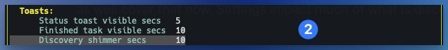

- **Status toast visible secs** - toasts pop up with notifications in the bottom right of cargo-port. This is how long they stay visible.

- **Finished task visible secs** - tasks such as "Startup" and "Lint runs" also have a duration they are visible when finished.  Lint runs can run for some time, and if new runs start on other projects, they will group together.  Sometimes it is helpful to see all of this before it disappears so you can control this timing also.

- **Discovery shimmer secs** - when a new project shows up in your scanned `Include dirs` the text will "shimmer" for this amount of time, to catch your attention. Pure chrome.

#### 3 - CPU

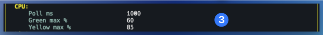

- **Poll ms** - how frequently do we poll for core stats

- **Low utilization max %** - the highest CPU usage considered low utilization

- **Medium utilization max %** - the highest CPU usage considered medium utilization

High utilization is anything above the medium threshold.

#### 4 - Lints

A list of commands can be configured in the Lints section. These commands will run after every file edit of a rust file or the Cargo.toml within the project.

When a lint is running a "spinner" will show up in the Lint column in the project tree, the lint row on the details pane and also a toast will pop up in the bottom right. If more than one lint is running, the toast in the bottom right will accumulate a row for each concurrently executing lint run.

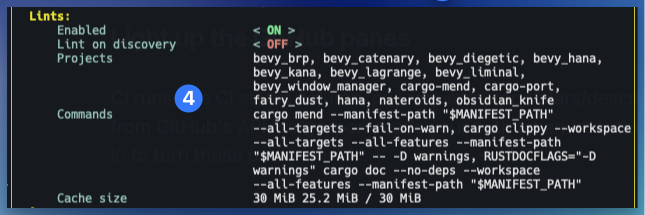

- **Enabled** - turn it on or off

- **Lint on discovery** - when a new project is added, will a lint run automatically on it? Depending on the lint, this could kick off an unwanted build so use this with caution.

- **Projects**  - this feature is opt-in, it will not lint every project scanned, you have to explicitly specify which ones you wish to lint in a comma-delimited list.

- **Commands** - a comma-delimited list of lint runs. I'm thinking about putting mine into a bash file as it makes this example hard to read...

- **Cache size** - lints don't take up much space. And in practice you rarely need to look at old runs. You can make this as big as you want but a few megabytes will probably be fine. If your workflow would benefit from more or less lint cache space, you're in charge.

#### 5 - Appearance

cargo-port supports light / dark mode and will follow your OS's settings if you like.

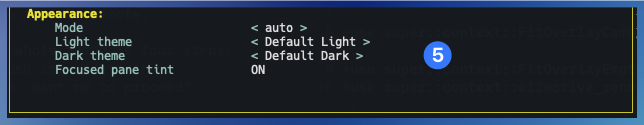

- **Mode** - auto - follow the OS.  Light and Dark can be explicitly chosen.

- **Light theme** - A default and high contrast theme are included out of the box.

- **Dark theme** - A default and high contrast theme are included out of the box.

- **Focused pane tint** - whether or not to tint the background of the focused pane.

**User themes**

User themes are optional TOML files placed in `dirs::config_dir()/cargo-port/themes/`. The app does not create this directory or seed theme files there; use the theme TOML files in the repository’s `tui_pane/themes/` directory as examples.

### Project tree

On startup, the configured `Include dirs` are scanned by cargo-port to retrieve Cargo.toml metadata, GitHub metadata including CI runs, disk usage, local lint pass/fail status, programming language line counts and configured targets.

The Project Tree is the main navigation point for the app - other panes adapt to show detailed information about the selected row in the tree.

We set a file watcher on these projects so any changes will invoke a lint run (if configured). New projects will automatically appear and deleted projects will disappear.  Disk space adjusts itself automatically with each changed file and recompile.

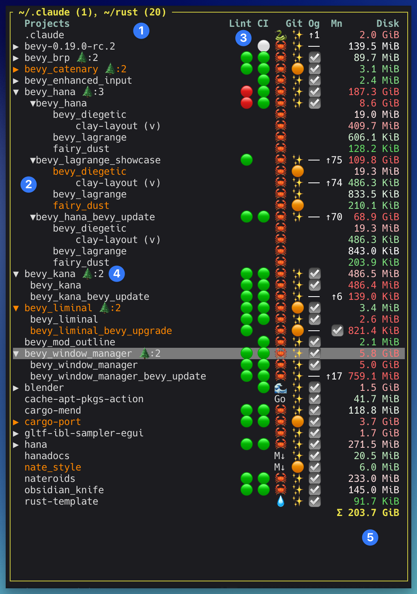

1. The title shows scanned directories and project counts for each configured scan dir.  On first run, cargo-port will prompt you to define your "Include dirs" in Settings.
2. Hierarchical project tree with expandable workspaces, members, worktrees, submodules, and vendored crates. You can configure whether non-Rust git projects are included.
3. Status columns
	1. Lint pass/fail - a lint command configurable in settings. Lint column will show an activity spinner for a currently running lint.
	2. CI passed 🟢, failed 🔴, skipped ⚪, cancelled ⚫. Not shown if ci is not configured or if a remote isn't configured for a branch. Currently only supports GitHub.
	3. Git status - clean ✨, modified 🟠, untracked 🟢
	4. Origin sync - whether the project is synced (☑️), with configured origin or ahead/behind
	5. main sync whether a worktree checkout is synced (☑️) with the main branch or ahead/behind
	6. Disk usage - Σ
4. Worktree-group rows with branch and status rollups. Any row with a tree emoji (🌲) is a worktree group and appends the count of checkouts next to it (🌲:2).  You can expand it to see info about each separate checkout.
5. Total disk usage across the visible project set because, you know, rustc consumes a lot of disk.  There is a keyboard shortcut (defaults to 'c') to clean the currently selected workspace/project.

### Detail pane

This space adapts to show a distinct details pane based on what is selected in the Project pane. You can see useful information for all of these:

- Workspace
- Package
- Worktree Group
- Non-rust Project
- Git Submodule
- Vendored crate

Below, we're showing a Worktree Group as an example as the rest will be self-explanatory when you run the app.  The Worktree Group is a good representative as it is one of the more comprehensive detail panes.

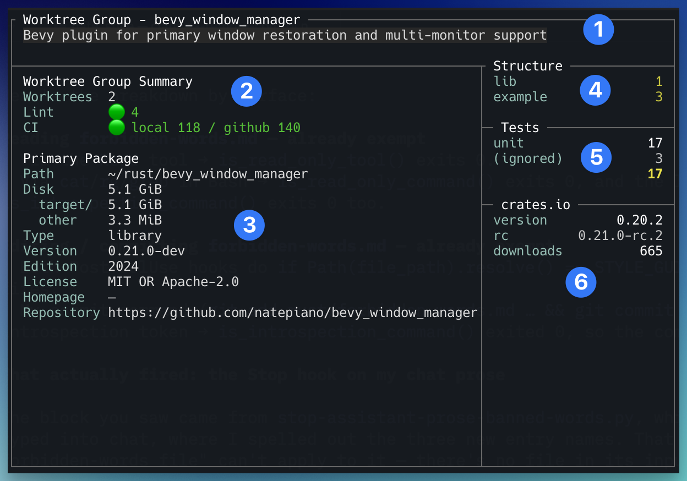

1. Title shows what kind of detail pane is shown - in this case it's a WorktreeGroup for the bevy_window_manager project.  The description from Cargo.toml is shown if there is one.
2. Summary of how many worktrees, the aggregate lint status across all checkouts, and the CI status from GitHub. The numbers show local cached run metadata and how many runs are there in total on GitHub.
3. Package location, disk breakdown and metadata from Cargo.toml
4. Structure indicates what targets are configured - counts of bins, libs, examples, benches, proc-macros.
5. Tests shows counts of unit, integration and doc tests as well as the count of ignored. It doesn't attempt to break it out by feature gates so it may not always match up exactly.
6. crates.io version info and download count

### Git pane

cargo-port uses local git data plus GitHub's REST and GraphQL APIs, authenticated with the token from your `gh` login (see [Try me](#try-me)).

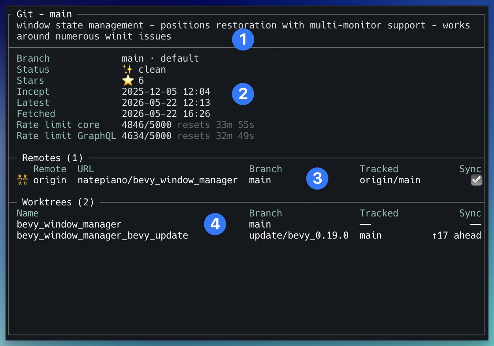

1. Pane title shows the current branch and the description from GitHub if it exists.
2. Branch info, status, stars. Project incept date and date of latest commit. Also date of last fetch.  Rate limits exist on GitHub so we show them in case you are hammering github with requests, you'll see it reflected here.  GitHub has different limits for core and GraphQL requests so we show both as well as a countdown timer as to when the limit will reset.
3. All configured remotes - including sync (synced/ahead/behind) status between the branch and the tracked origin.
4. All worktree checkouts. The primary checkout (where the .git directory lives) isn't tracked versus anything so just shows dashes for Tracked and Sync. Other checkouts show their branch and tracked status versus the local main. It's what i find most useful in my workflow - and I'm interested in other points of view so make an issue or a PR and we'll discuss.

### Languages pane

cargo-port uses the tokei crate to scan project languages at startup. It doesn't refresh automatically but you can always ctrl-r to rescan (default key binding) if your curiosity is getting to you. Can you guess what famous rust game engine has these stats?

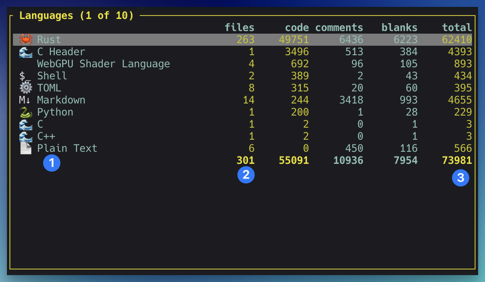

1. Detected languages with file-type icons. Some icons are better than others. Some don't exist. Not wanting to get even deeper into fonts, emojis, and specific terminal implementations, we're doing the best we can.
2. File counts per language.
3. Code, comment, blank-line, and total-line counts.

What good is this? Is this useful information taking up valuable screen real estate? I don't know. But we have it so enjoy!

### CPU/GPU pane

Dynamic CPU/GPU usage. If this doesn't get you out of bed in the morning, I don't know what will.  On my MacBook Pro, I have 12 cores. And it all fits in the pane.  But you might have many more. Don't worry, it will scroll - or you might turn your terminal sideways and see them all. The aggregate is the signal; per-core is for the satisfaction of watching a cargo build peg every core.

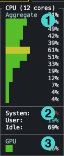

1. Per-core CPU usage bars.
2. Aggregate system, user, and idle CPU percentages.
3. GPU utilization when available for the current platform. Not super tested for your particular wacky setup yet.  GPU is an aggregate right now. If you don't like this view, PRs are welcome. 

"You will ride eternal, shiny and chrome".

### Targets pane

The targets pane will show you this project's targets - bins, examples, benches.

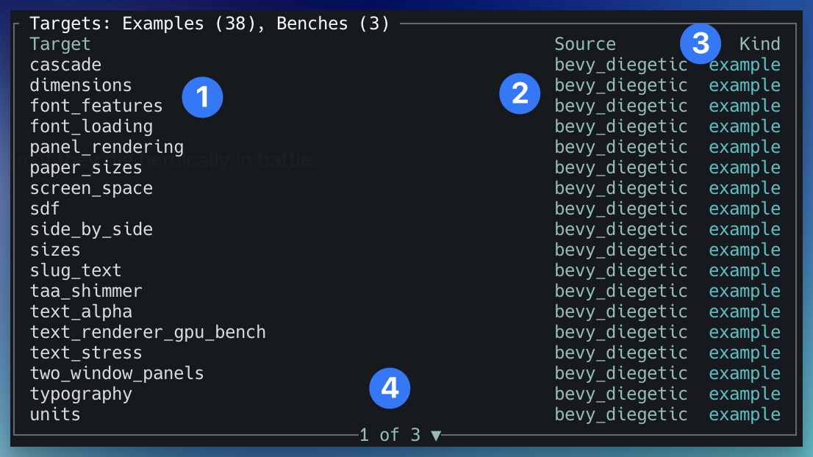

1. The title bar of the pane will show you the count of each kind of target that is available in your project
2. Runnable target names - you can launch it by hitting 'Enter' for a debug run, 'r' for `cargo run --release`.  The Source package is listed as a convenience so you don't have to scan back over to the project window. If it's a workspace, you'll see each target listed with its associated package. If it's a worktree group, you'll see the worktree checkout prefix the package (e.g. `worktree_checkout/package_name`).
3. This screenshot has both examples and benches available to run. An output overlay window will pop up to show you the stdout when you run one.
4. Also in the Targets window you will see a second subpane showing currently running projects. If you installed cargo-port it will group it under an expandable `cargo` label where all running cargo sub commands can be found (while they're running).
5. Every other target you have launched from cargo-port will show below that - in whichever profile you ran them in. You can type 'K' to kill (uppercase to not clash with vim bindings in case you turned them on). If a process launches other processes, they will group into an expandable hierarchy.

### Lint runs

You may optionally configure a comma delimited list of commands to run as a lint on rust projects (only).  The included directories have a watcher on them and if any rust file or Cargo.toml changes, then the lint commands will be asynchronously executed and tracked to completion.

When finished results from historical runs will show in the Lint Runs pane.

You can select and hit enter on a run to open the stdout from each command in your configured editor.

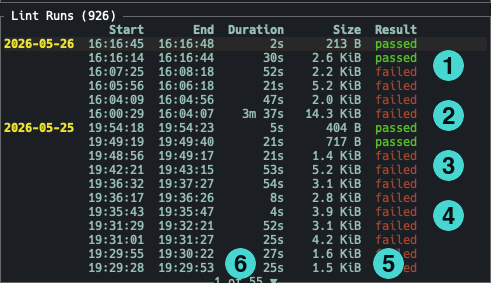

1. Run dates are grouped to make this pane less busy.
2. Runtime duration.
3. Cached output file size. Total Lint run storage space is configurable. Oldest runs are automatically evicted when they exceed the configured limit.
4. Pass/fail result.

### CI runs

GitHub Actions runs are cached to disk so the dashboard stays useful offline.

Press `Enter` on any row to open that CI in GitHub.

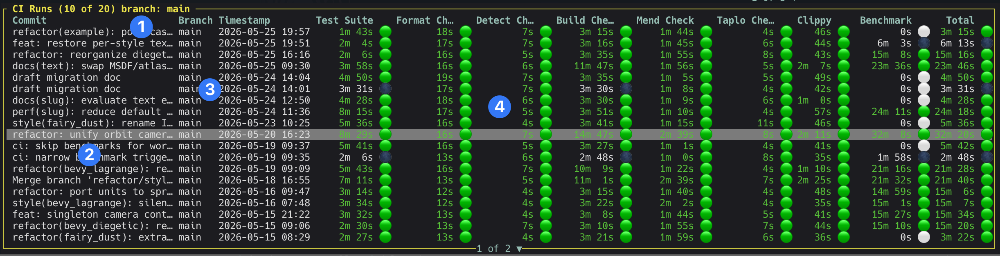

1. CI run count and selected branch. You can filter for the current branch or show all ci runs.
2. Commit summary for each run.
3. Branch and timestamp. 'Nuff said.
4. Job-level status columns. These are constructed from the ci runs themselves. If there are too many columns it will show the ones that have the longest durations and collapse the ones that don't.

**CI Key**
- passed 🟢
- failed 🔴
- skipped ⚪
- cancelled ⚫

**Note:** The automatically selected columns may not be helpful to you but you can press enter on any run and it will open a browser to take you to that run in GitHub where you can see everything you want to see.

## Global shortcuts

Press `?` in the TUI to open the global shortcuts overlay.

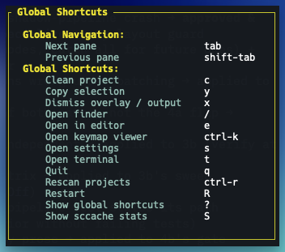

- Next and Previous are self explanatory
- **Clean** does a cargo clean (with a modal yes/no prompt) on a selected rust project. If you select a worktree checkout, it will clean all targets.
- **Dismiss overlay / output**
	- When you delete a project or a worktree checkout, that row doesn't immediately disappear in the project tree - it outputs with a strikethrough and you can select it and hit x to cancel it.
	- Same goes for toasts that pop up in the bottom right corner
- **Open finder** - not a macos thing - this is a fuzzy search of any project or target. Lets you jump directly to it. Slick.
- **Open in editor** - configure your editor and then press this shortcut to open the currently selected project in it.
- **Open keymap viewer** - you can remap all shortcuts except VIM - maybe some day VIM, too.
- **Open settings** - just as it says.
- **Quit** - don't accidentally hit q if you don't want to quit :) - fortunately cargo-port starts fast so quit and restart all you want.
- **Rescan projects** - that's what it does.
- **Restart** - I have this in there for debugging - the make a change, install, restart loop. I don't know if this will be useful to you but it is why Rescan is on ctrl-r.
- **Show global shortcuts** - this overlay
- **Show sccache stats** - I mean - you could just run `sccache --show-stats` but hey, `S` is faster. Pure plating - you choose the metal.

## Keymap editor

Press ^k to open the Keymap editor (if you haven't already remapped it). Select a row and press enter to change it to what you like.

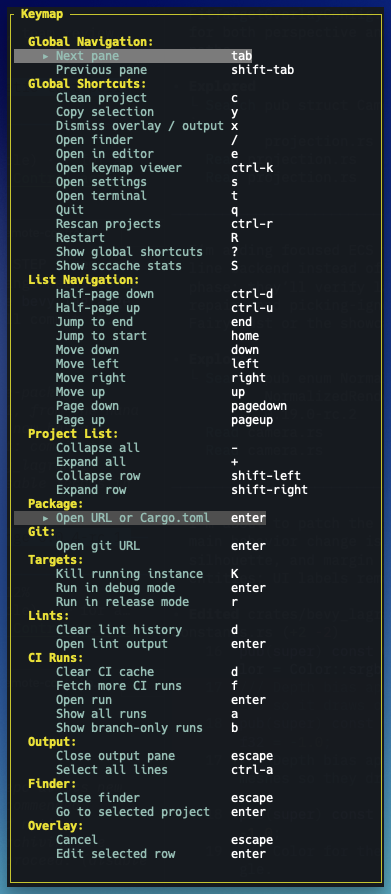

I'm not going to go through keymaps one by one as they are largely self-explanatory.

## Where paths live

cargo-port uses the platform directories provided by the `dirs` crate:

| Platform | Config root | Cache root |
| --- | --- | --- |
| macOS | `~/Library/Application Support/cargo-port` | `~/Library/Caches/cargo-port` |
| Linux | `~/.config/cargo-port` | `~/.cache/cargo-port` |
| Windows | `%APPDATA%\cargo-port` | `%LOCALAPPDATA%\cargo-port` |

- **Config file** - `<config root>/config.toml`
- **Keymap file** - `<config root>/keymap.toml`
- **User themes** - optional TOML files in `<config root>/themes/`
- **CI cache** - `<cache root>/ci/`
- **Lint runs** - `<cache root>/lint-runs/`

## Platforms

Tested primarily on macos, limited testing on windows and linux.

## License

`cargo-port` is free, open source and permissively licensed!
Except where noted (below and/or in individual files), all code in this repository is dual-licensed under either:

* MIT License ([LICENSE-MIT](LICENSE-MIT) or [http://opensource.org/licenses/MIT](http://opensource.org/licenses/MIT))
* Apache License, Version 2.0 ([LICENSE-APACHE](LICENSE-APACHE) or [http://www.apache.org/licenses/LICENSE-2.0](http://www.apache.org/licenses/LICENSE-2.0))

at your option.

### Your contributions

Unless you explicitly state otherwise, any contribution intentionally submitted for inclusion in the work by you, as defined in the Apache-2.0 license, shall be dual licensed as above, without any additional terms or conditions.
