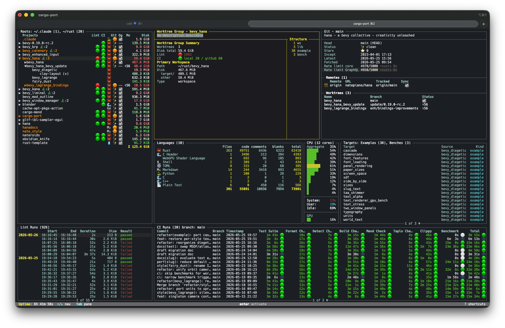
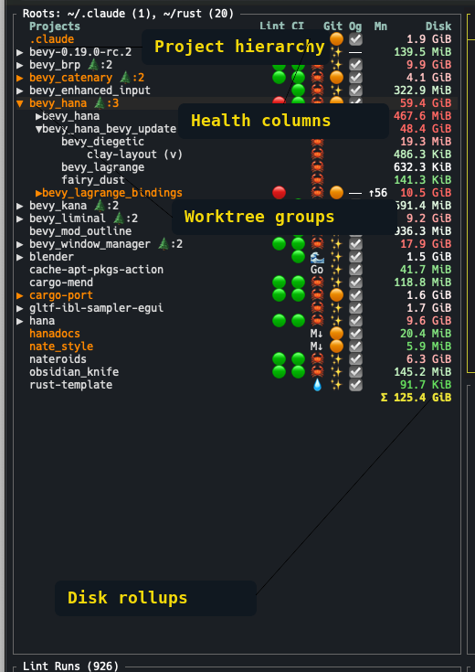
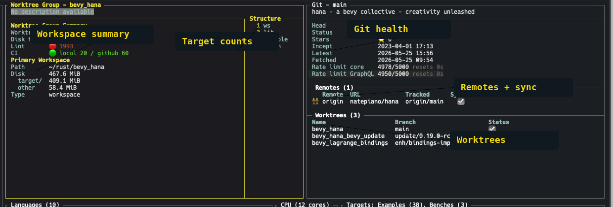
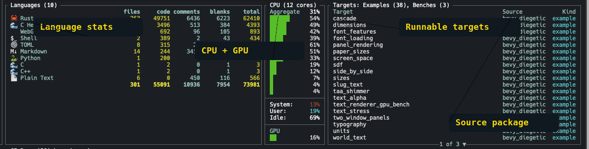
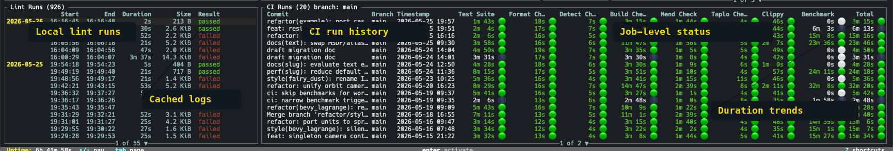

# cargo-port

[](https://github.com/natepiano/cargo-port/actions/workflows/ci.yml)
[](https://crates.io/crates/cargo-port)
[](https://docs.rs/cargo-port)
[](LICENSE-MIT)



A terminal dashboard for a Rust workspace forest. Point it at a directory and it keeps workspaces, crates, worktrees, vendored dependencies, targets, local lint state, GitHub CI, pull requests, and machine diagnostics in one keyboard-driven view.

- **Inventory everything** - workspaces, members, linked worktrees, submodules, vendored crates, examples, benches, binaries, tests, and non-Rust git repos
- **Run and inspect targets** - launch examples, benches, and binaries in debug or release mode with live output and running-target markers
- **Track project health** - see lint status, archived lint runs, GitHub Actions history, open pull requests, PR check polling, and GitHub rate-limit state
- **Keep context visible** - inspect package metadata, target directories, language stats, worktree summaries, remotes, CI jobs, and pull request rows without leaving the TUI
- **Navigate quickly** - fuzzy search, vim-style paging, chord keymaps, tab traversal, edge-scroll pane movement, global shortcuts, and selection copy
- **Tune the view** - runtime themes, light/dark/high-contrast variants, user theme hot-reload, appearance settings, and CPU/GPU/sccache diagnostics

## Try me

Build the current `main` branch:

```bash
git clone https://github.com/natepiano/cargo-port.git
cd cargo-port
cargo build
cargo run
```

Install the latest published crates.io release:

```bash
cargo install cargo-port
cargo-port
```

## What You Can See

The main dashboard combines the project tree with detail panes for package metadata, Git state, languages, targets, diagnostics, lint history, and CI runs.



- **Project tree**: groups workspaces, members, linked worktrees, submodules, vendored crates, and optional non-Rust repos under the configured scan roots
- **Package and targets**: shows Cargo metadata-backed type, version, edition, license, homepage, repository, target, example, bench, and binary information
- **Git and pull requests**: shows branch, sync status, remotes, worktrees, GitHub rate-limit state, open PR rows, and PR check polling
- **Diagnostics**: shows CPU usage per core, GPU utilization when available, and sccache statistics when `sccache` is configured
- **Lint and CI history**: shows local lint/watch runs from disk and GitHub Actions run history with job-level status and durations







## Navigation

Press `?` in the TUI to open the global shortcuts overlay.

- Use `/` to fuzzy-find projects, packages, examples, benches, binaries, and tests
- Use `Tab` to move between panes; optional edge-scroll can advance focus when a list hits its top or bottom
- Enable vim navigation with `navigation_keys = true` for `hjkl` movement in non-text panes
- Use chord keymaps for multi-key commands and `y` to copy the selected pane row's path, URL, or field value when available
- Open projects, config, keymaps, GitHub URLs, crates.io pages, and terminal sessions from the selected context

## GitHub, CI, and PRs

cargo-port uses local git data plus the GitHub CLI where available.

- GitHub Actions runs are cached to disk so the dashboard stays useful offline
- Pull request rows show open PRs for the selected repo, including deleted/disappeared PR toasts and check polling
- GitHub API rate-limit and service recovery state are shown in the Git pane
- If `gh` is missing or unauthenticated, cargo-port warns in the UI instead of silently hiding the problem

## Themes and Diagnostics

The TUI has runtime-swappable themes and lightweight machine diagnostics.

- Built-in themes include default dark, default light, and high-contrast variants
- User themes live under the platform config directory in `cargo-port/themes/` and reload while the app is running
- `[appearance]` can follow the OS appearance or force light/dark mode
- The CPU/GPU pane refreshes in the background; GPU availability depends on platform support
- The sccache pane appears when a configured Rust compiler wrapper points at `sccache`

## Configuration

cargo-port creates a config file on first run at:
- **macOS**: `~/Library/Application Support/cargo-port/config.toml`
- **Linux**: `~/.config/cargo-port/config.toml`

### Scan directories

By default, cargo-port scans the entire scan root (defaults to `~`). To limit scanning to specific directories, set `include_dirs` in the config file or via the in-app settings editor (press `s`).

Paths can be relative to the scan root or absolute:

```toml
[tui]
include_dirs = ["rust", "projects", "/opt/work"]
```

An empty list (the default) scans the entire scan root. Changes to `include_dirs` in the settings editor trigger an automatic rescan.

### Include non-Rust projects

To also show non-Rust git repositories in the project tree:

```toml
[tui]
include_non_rust = true
```

These show up with reduced details (no types, version, examples) but can still display disk usage, git info, and CI runs.

### Navigation

```toml
[tui]
navigation_keys = true
edge_scroll = true
```

`navigation_keys` enables `hjkl` movement in non-text panes. `edge_scroll` moves focus to the adjacent pane when scrolling past the top or bottom of a list.

### Appearance

```toml
[appearance]
mode = "auto"
light_theme = "Default Light"
dark_theme = "Default Dark"
focused_pane_tint = true
```

`mode` accepts `"auto"`, `"light"`, or `"dark"`. Custom themes can be added under the platform config directory:
- **macOS**: `~/Library/Application Support/cargo-port/themes/`
- **Linux**: `~/.config/cargo-port/themes/`

### Diagnostics

```toml
[cpu]
poll_ms = 1000
green_max_percent = 60
yellow_max_percent = 85
```

CPU and GPU diagnostics refresh in the background. GPU usage is shown when cargo-port can read it from the current platform; otherwise the GPU row reports unavailable.

### Lints

Lints is cargo-port's local lint/watch runtime. When enabled, cargo-port watches only the projects you allow-list, runs configured commands when they change, and shows the current status in the project list.

Lints is off by default.

In the Settings popup (`s`), the `Lints` section exposes:
- `Enabled`
- `Projects`
- `Commands`
- `Cache size`

`Projects` is an allow-list. If it is empty, Lints watches nothing.

#### Basic config

```toml
[lint]
enabled = true
include = ["cargo-port", "bevy_lagrange"]
exclude = []
commands = []

[port_report]
cache_size = "512 MiB"
```

Notes:
- `include` entries can be bare project names, display-path prefixes, or absolute-path prefixes
- `exclude` is applied after `include`
- an empty `commands` list uses the built-in default command
- `port_report.cache_size` caps retained lint run storage across JSON history and cached artifacts; `0` and `unlimited` disable pruning

#### Commands

The released default is a single clippy command:

```toml
[lint]
enabled = true
include = ["cargo-port"]
exclude = []
commands = []

[port_report]
cache_size = "512 MiB"
```

That expands to:

```toml
[[lint.commands]]
name = "clippy"
command = "cargo clippy --workspace --all-targets --all-features --manifest-path \"$MANIFEST_PATH\" -- -D warnings"
```

If you want to override that, you can configure explicit commands:

```toml
[lint]
enabled = true
include = ["cargo-port"]

[[lint.commands]]
name = "mend"
command = "cargo mend --manifest-path \"$MANIFEST_PATH\" --all-targets"

[[lint.commands]]
name = "clippy"
command = "cargo clippy --workspace --all-targets --all-features -- -D warnings"
```

`command` is executed as a shell command in the project root, not as an implied Cargo subcommand. That means values like `cargo fmt --check`, `cargo mend --manifest-path "$MANIFEST_PATH" --all-targets`, `cargo clippy --workspace --all-targets --all-features --manifest-path "$MANIFEST_PATH" -- -D warnings`, or `something --else` are all valid.

In the Settings popup, `Commands` accepts a comma-separated list of full shell commands.

Legacy preset-style entries such as `clippy` or `mend` are normalized to their built-in command definitions when config is loaded or saved.

#### Cache size

`port_report.cache_size` accepts flexible binary-size strings such as:
- `512MiB`
- `512 MiB`
- `1.5 GiB`
- `0`
- `unlimited`

Values are normalized when config is loaded or saved. The cache size caps retained lint run storage under the shared cache root. When stored runs exceed the limit, cargo-port prunes the oldest runs first and keeps current/latest artifacts even if that live floor alone exceeds the configured size.

#### Cache location

Lints writes its cache under cargo-port's shared cache root.

By default this uses the platform cache directory:
- macOS: `~/Library/Caches/cargo-port`
- Linux: `~/.cache/cargo-port`

You can override the root:

```toml
[cache]
root = ""
```

Rules:
- empty string means use the default platform cache root
- a relative path extends the default cargo-port cache root
- an absolute path replaces it

Lint run data is stored under `lint-runs/` within the cache root. CI cache uses the same shared root under `ci/`.
