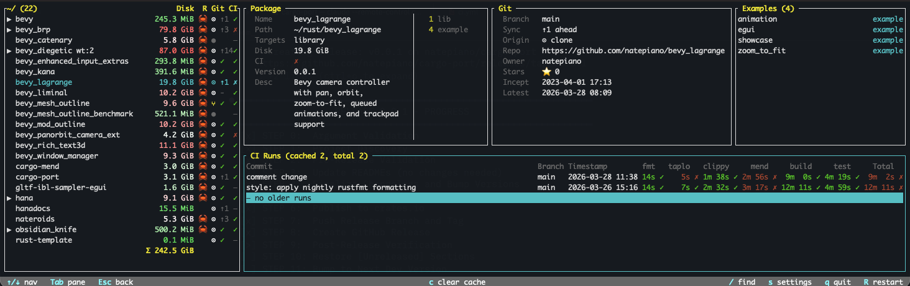

# cargo-port

[](https://github.com/natepiano/cargo-port/actions/workflows/ci.yml)
[](https://crates.io/crates/cargo-port)
[](https://docs.rs/cargo-port)
[](LICENSE-MIT)



A terminal dashboard for all your Rust projects. Point it at a directory and it discovers every workspace, crate, worktree, and vendored dependency underneath.

- **Find everything** — examples, benchmarks, binaries, and test targets across all your projects in one place
- **Launch instantly** — run any example, benchmark, or binary in debug or release mode with live output
- **Jump to context** — open crates.io, GitHub, or your editor directly from any project field
- **CI at a glance** — per-project GitHub Actions status with job-level detail and run history
- **Fuzzy search** — find any project, example, or binary across your entire tree in seconds
- **Offline-ready** — CI data cached to disk, works without network

## Try me

```bash
git clone https://github.com/natepiano/cargo-port.git
cd cargo-port
cargo build
cargo run
```

## Configuration

cargo-port creates a config file on first run at:
- **macOS**: `~/Library/Application Support/cargo-port/config.toml`
- **Linux**: `~/.config/cargo-port/config.toml`

### Scan directories

By default, cargo-port scans the entire scan root (defaults to `~`). To limit scanning to specific directories, set `include_dirs` in the config file or via the in-app settings editor (press `s`).

Paths can be relative to the scan root or absolute:

```toml
[tui]
include_dirs = ["rust", "projects", "/opt/work"]
```

An empty list (the default) scans the entire scan root. Changes to `include_dirs` in the settings editor trigger an automatic rescan.

### Include Non-Rust Projects

To also show non-Rust git repositories in the project tree:

```toml
[tui]
include_non_rust = true
```

These show up with reduced details (no types, version, examples) but can still display disk usage, git info, and CI runs.
